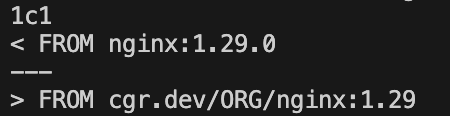
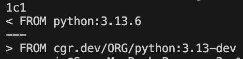

# Convert Dockerfile to use Chainguard Images

# Prerequisites
- Install:
  - [Dockerfile Converter a.k.a. `dfc`](https://edu.chainguard.dev/chainguard/migration/dockerfile-conversion/#installation)
  - grype
  - chainctl

## Convert Frontend
- Show the Dockerfile in `frontend/Dockerfile`
- Run the command `dfc frontend/Dockerfile > frontend/Dockerfile.converted`
- Run the command `diff frontend/Dockerfile frontend/Dockerfile.converted`
- This is a pretty simple conversion, since there is no `RUN` command or dependencies installed. The main change is the base image in the `FROM` line.

There are some additonal steps required here. To use the image, our docs mention that the default port is 8080, not 80. So we update the `EXPOSE` line to expose port 8080 in the container. Additionally, we update the `CMD` line to use `ENTRYPOINT` since we lack a shell in this image.

## Convert Backend
- Show the Dockerfile in `backend/Dockerfile`
- Run the command `dfc backend/Dockerfile > backend/Dockerfile.converted`
- Run the command `diff backend/Dockerfile backend/Dockerfile.converted`

Initially, the main change is the suggested Chainguard image.

However, the `CMD` line will be an issue since we need to access the shell to run the command. [In our docs](https://console.chainguard.dev/org/chainguard-private/images/organization/image/python/overview), we mention that we need to include an entrypoint, so we can update the Dockerfile to use an `ENTRYPOINT` instead of a `CMD`.

## Pin to versions
For both images, we also update the default `ORG` to our org name, and pin to a specific SHA, so we can leverage tools like `digestabot` to update digests when there are updates to the image tags, keeping our images fresh and vulnerability free.

## Update application images
Finally, we update our `compose.yml` file to use the Chainguard postgres image, pinned to a specific digest.

## Run the app
Now we can run our application locally to check that we didn't break anything by running `docker compose up --build`, or if using the pre-made files, run `docker compose -f compose-cg.yml up --build` for the Chainguard version.

## Bonus Jonas
You can scan the images for vulnerabilities by running `grype cg-e2e-frontend` and `grype cg-e2e-backend`.

## Troubleshooting
Make sure you authenticate via chainctl: `chainctl auth configure-docker`